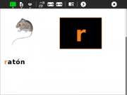

# Activities/I can read - Sugar Labs

## I can read (Soy capaz de leer)

I can read is an activity for introducing the basics of phonetic reading. It displays letters and images and associated sound files, such as 'A as in apple'. It also puts the letters into a context that coalesces into words and phrases as more letters are added. Students can hear sounds and record their own voice either repeating the sound or reading aloud. 

|  |  |  |  |  |  |   
|---|---|---|---|---|---| 
| r como raton | the letter r used in context |choosing a letter to study | practice phrases | student recording |teachers can prepare lessons | 
  
(Also see [AEIOU](https://github.com/sugarlabs/AEIOU), [I Know My ABCs](https://github.com/sugarlabs/iknowmyabcs), and [Letter Match](https://github.com/sugarlabs/lettermatch) 

### Toolbars

 

### Notes

* As of Version 1, only a basic Spanish lesson is included.
* The tools for adding new lessons are not completed, so they must be generated by hand in a comma-separated-values (CSV) file (See lessons/es/nivel-1.csv for an example).

## Lesson-format details

Lessons are in .csv files, one row per letter, using comma separators. letters in ()s are rendered using the color specified in the table. is used to force a line break. Sound files should be recorded as .ogg. Image files should use PNG format and the same name as the word, e.g., raton.png. 

|  letter  |  word  |  color (#RRGGBB) |  color name  | sound file  |  practice phrase  | 
|---|---|---|---|---|---|
| R  |  (r)atón  |  #F08020  |  naranja  | r-como-raton.ogg |  Kika come ki i El ki ipe a n kilo A e a e dijo el homb(r)eal b o El fan a mae a en la f en e Elfan a ma a o a Fidel Ale oca el ilofono Ña a como piña a lamañana En(r)iq e q ie(r)eel paq e e de q e o q e e ende en la e q ina ane a a c on ein e ela el a o acio o(r)a el niño po(r)q edejo la a e en elbo l i o El apa e(r)o iene apa i a a le (R)a l iajo a (R)oma con(R)o a J lio Jaime  | 
